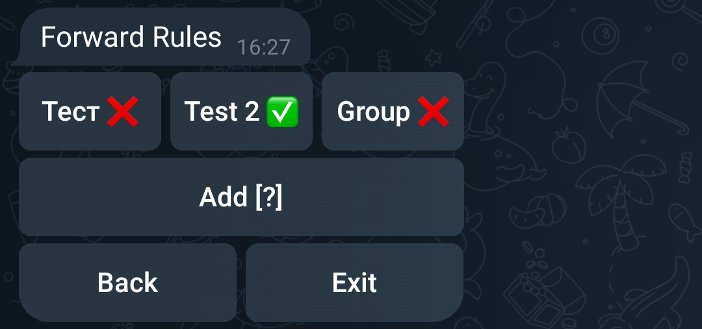
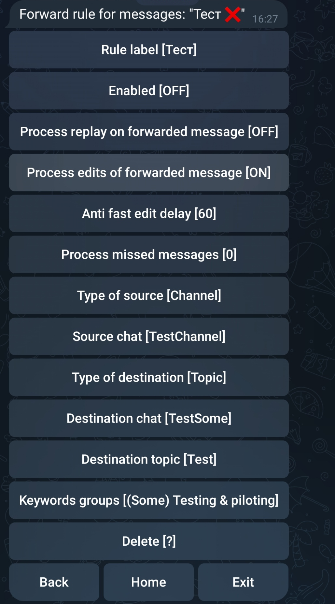
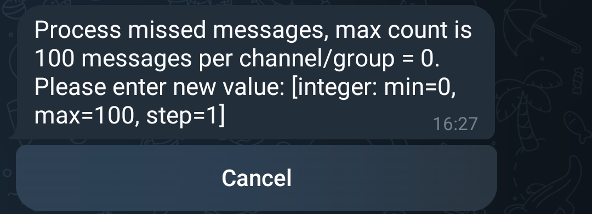
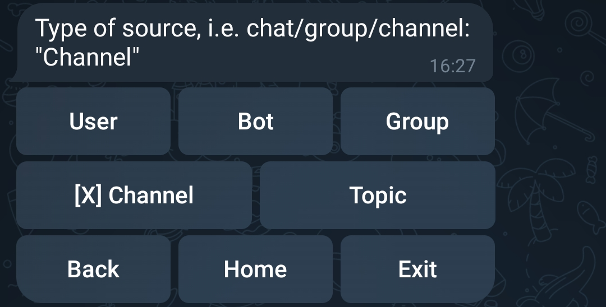
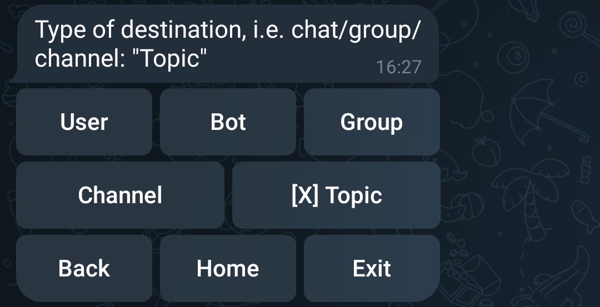
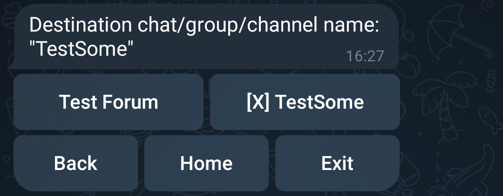
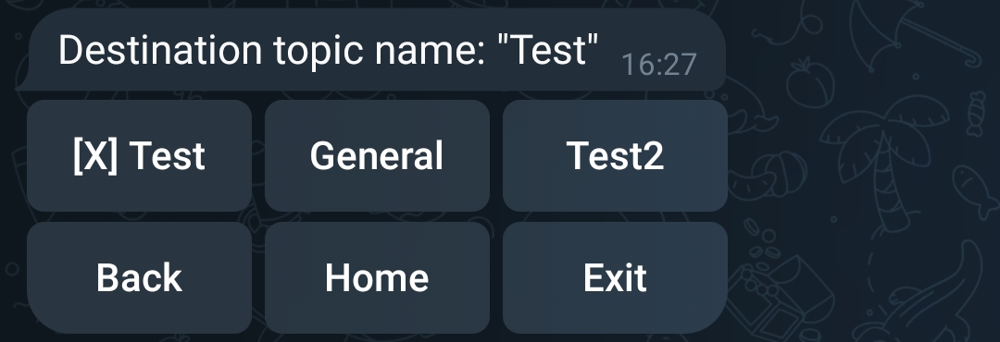
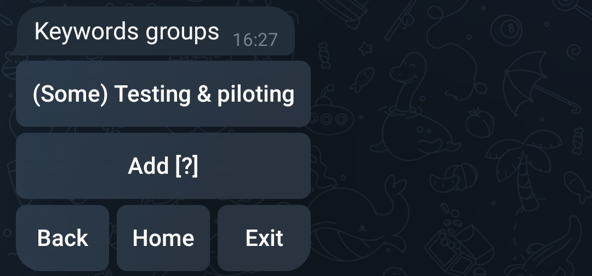
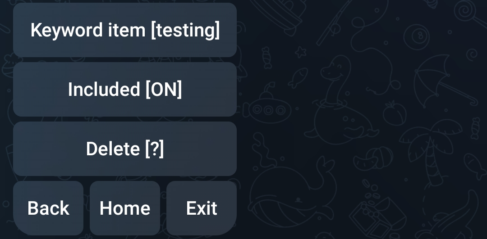

# Telegram Forward User Bot

[](https://hub.docker.com/r/petrovoronov/telegram-forward-user-bot)
[](https://hub.docker.com/r/petrovoronov/telegram-forward-user-bot)
[](LICENSE)
[](https://github.com/PetroVoronov/telegram-forward-user-bot/commits/main)
[](https://github.com/PetroVoronov/telegram-forward-user-bot/issues)
[](https://github.com/PetroVoronov/telegram-forward-user-bot/pulls)

## About

A Telegram "bot" working as a user, using MTProto via [gramjs](https://github.com/gram-js/gramjs), to forward messages between chats/groups/channels. Configurable via Bot menu.

## Description

This package provides a functionality to forward messages between chats/groups/channels using a Telegram API to work as a user.
It has a built-in bot to configure the behavior of the user instance.
The bot can be used to configure:

- the common parameters, such as setting the refresh interval, the number of columns in a row, the text summary max length, the space between columns, the max buttons on a "page", and additional users.
- The forwarding rules itself, such as the source chat and the destination chat, including the separate topics for "forums" and "super groups", and keywords or phrases to filter messages.

## Table of Contents

- [Telegram Forward User Bot](#telegram-forward-user-bot)
  - [About](#about)
  - [Description](#description)
  - [Table of Contents](#table-of-contents)
  - [Prerequisites](#prerequisites)
  - [Installation](#installation)
    - [Docker image installation](#docker-image-installation)
    - [Node.js installation from the source code](#nodejs-installation-from-the-source-code)
  - [Basic configuration parameters](#basic-configuration-parameters)
    - [Environment variables in case of working as telegram user (default):](#environment-variables-in-case-of-working-as-telegram-user-default)
  - [Command Line Options](#command-line-options)
  - [Running](#running)
    - [Running in Docker](#running-in-docker)
      - [Docker Volumes](#docker-volumes)
      - [Docker first run](#docker-first-run)
      - [Docker next runs](#docker-next-runs)
    - [Docker Compose](#docker-compose)
    - [Running Locally, i.e. via Node.js](#running-locally-ie-via-nodejs)
  - [Configuration via Telegram Bot Menu](#configuration-via-telegram-bot-menu)
    - [Accessing the Bot Menu](#accessing-the-bot-menu)
    - [Configuration Options](#configuration-options)
      - [Menu Language](#menu-language)
      - [Refresh Interval](#refresh-interval)
      - [Resubscribe Interval](#resubscribe-interval)
      - [Max Columns in Row](#max-columns-in-row)
      - [Text Summary Max Length](#text-summary-max-length)
      - [Space Between Columns](#space-between-columns)
      - [Max Buttons on "Page"](#max-buttons-on-page)
      - [Additional Users](#additional-users)
    - [Forwarding Rules](#forwarding-rules)
      - [Rule Configuration](#rule-configuration)
      - [Label](#label)
      - [Status](#status)
      - [Process replay on forwarded message](#process-replay-on-forwarded-message)
      - [Process edits of forwarded message](#process-edits-of-forwarded-message)
      - [Anti fast edit delay](#anti-fast-edit-delay)
      - [Process missed messages](#process-missed-messages)
      - [Source Chat Section](#source-chat-section)
        - [Source chat type](#source-chat-type)
        - [Source name](#source-name)
        - [Source topic](#source-topic)
      - [Destination Chat Section](#destination-chat-section)
        - [Destination chat type](#destination-chat-type)
        - [Destination name](#destination-name)
        - [Destination topic](#destination-topic)
      - [Filtering - Keywords groups](#filtering---keywords-groups)
  - [License](#license)
  - [Author](#author)

## Prerequisites

Node.js or Docker installed.

- Node.js (version 22 or later) and npm (version 7 or later)
- Docker, for running in a container

## Installation

### Docker image installation

```sh
docker pull petrovoronov/telegram-forward-user-bot
```

### Node.js installation from the source code

1. Use the repository

   - Clone the repository:

   ```sh
   git clone https://github.com/PetroVoronov/telegram-forward-user-bot.git
   cd telegram-forward-user-bot
   ```

   - Or download the source code from the [latest release](https://github.com/PetroVoronov/telegram-forward-user-bot/releases/latest) and extract it.For example for the version 1.4.5:

   ```sh
   wget https://github.com/PetroVoronov/telegram-forward-user-bot/archive/refs/tags/v1.4.5.tar.gz    # download the source code
   tar -xzf v1.4.5.tar.gz    # extract the source code
   cd telegram-forward-user-bot-1.4.5    # change the directory
   ```

   or

   ```sh
   curl -L https://github.com/PetroVoronov/telegram-forward-user-bot/archive/refs/tags/v1.4.5.tar.gz | tar -xz    # download and extract the source code
   cd telegram-forward-user-bot-1.4.5    # change the directory
   ```

2. Install the dependencies:

   ```sh
   npm install
   ```

## Basic configuration parameters

Basic configuration parameters - i.e. Telegram API credentials and Bot authentication token should be set on first run. It can be passed as environment variables, or you can skip it and application will ask you to enter it interactively.

After the first run, the configuration will be stored in the configuration in the application data directory: `data/`.

### Environment variables in case of working as telegram user (default):

```sh
export TELEGRAM_USER_API_ID=your_telegram_api_id
export TELEGRAM_USER_API_HASH=your_telegram_api_hash
export TELEGRAM_BOT_AUTH_TOKEN=your_telegram_bot_auth_token
```

**Notices**:

- Take in account that environment variables have a higher priority than the data stored in the configuration file. So, if you pass the environment variables, the configuration file will be overwritten by the data from environment variables.

- Additionally, you have to keep in mind that the Telegram API credentials will be used to authenticate the user instance and on the first run the application will ask you to enter the phone number, the code from the Telegram, as well as the password if 2FA is enabled.

## Command Line Options

The Telegram Forward User Bot supports several command line options to customize its behavior. Below are the available options:

| Option                   | Short | Description                                                | Type    | Default | Required |
| ------------------------ | ----- | ---------------------------------------------------------- | ------- | ------- | -------- |
| `--refresh-interval`     | `-r`  | Refresh information from Telegram servers, in seconds.     | number  | 300     | No       |
| `--resubscribe-interval` | `-s`  | Resubscribe on changes in sources chats, in minutes.       | number  | 60      | No       |
| `--no-bot`               | `-b`  | Start without the bot instance.                            | boolean | false   | No       |
| `--debug`                | `-d`  | Enable debug level logging.                                | boolean | false   | No       |
| `--no-debug-cache`       |       | Disable debug level logging for the Cache instance.        | boolean | false   | No       |
| `--no-debug-menu`        |       | Disable debug level logging for the Menu instance.         | boolean | false   | No       |
| `--debug-client-user`    |       | Enable debug level logging for the client "user" instance. | boolean | false   | No       |
| `--debug-client-bot`     |       | Enable debug level logging for the client "bot" instance.  | boolean | false   | No       |
| `--command`              | `-c`  | Test menu command from the command line.                   | string  |         | No       |
| `--help`                 | `-h`  | Display help information.                                  | boolean | false   | No       |
| `--version`              |       | Display the version of the script.                         | boolean | false   | No       |

## Running

On first run the application will ask for user authentication and the missing configuration parameters interactively.

### Running in Docker

By default the application will run without any additional command-line options.

Due to the limitations of the Docker environment, the application will not be able to ask for the missing configuration parameters interactively. That's why you need to make a first run in interactive mode to provide the missing parameters.

#### Docker Volumes

**You must to map the application data directory to the container:**

- `/app/data` - for the application data, including the configurations and the some other actual data. Mandatory for the mapping!
  You can map in on any local directory on the host system or docker volume.

#### Docker first run

So, the first run should be like one of the following:

- to set all basic configuration parameters interactively:
  ```sh
  docker run -it --rm -v $(pwd)/data:/app/data --name telegram-forward-user-bot petrovoronov/telegram-forward-user-bot
  ```
- to set all basic configuration parameters via environment variables:
  ```sh
  docker run -it --rm -v $(pwd)/data:/app/data \
  -e TELEGRAM_USER_API_ID=your_telegram_api_id \
  -e TELEGRAM_USER_API_HASH=your_telegram_api_hash \
  -e TELEGRAM_BOT_AUTH_TOKEN=your_telegram_bot_auth_token \
  --name telegram-forward-user-bot petrovoronov/telegram-forward-user-bot
  ```
- If you want to pass additional command-line options, you can add them to the end of the command. For example, to set the refresh interval to 300 seconds and the resubscribe interval to 60 minutes:
  ```sh
  docker run -it --rm -v $(pwd)/data:/app/data \
  -e TELEGRAM_USER_API_ID=your_telegram_api_id \
  -e TELEGRAM_USER_API_HASH=your_telegram_api_hash \
  -e TELEGRAM_BOT_AUTH_TOKEN=your_telegram_bot_auth_token \
  --name telegram-forward-user-bot petrovoronov/telegram-forward-user-bot --refresh-interval 300 --resubscribe-interval 60
  ```

**Important notice: pass all later needed command-line options at first run!\***

After the first run the application will store the configuration parameters and additional info - please stop the container by pressing `Ctrl+C` and start it again with the commands from the next section.

#### Docker next runs

After the first run you can run the application with the same configuration parameters as the previous run without any additional command-line options.

To start the application, run the following command:

```sh
docker run telegram-forward-user-bot
```

To stop the application, run the following command:

```sh
docker stop telegram-forward-user-bot
```

### Docker Compose

To run the application using Docker Compose, create a `docker-compose.yml` file with the following content:

```yaml
version: '3'
services:
    telegram-forward-user-bot
        image: petrovoronov/telegram-forward-user-bot
        volumes:
            - ./data:/app/data
        environment:
            - TELEGRAM_USER_API_ID=your_telegram_api_id
            - TELEGRAM_USER_API_HASH=your_telegram_api_hash
            - TELEGRAM_BOT_AUTH_TOKEN=your_telegram_bot_auth_token
```

Replace `/path/to/your/config` with the actual paths on your system where you want to store the application config.

If you want to start the application with the additional command-line options, you can add them to the `command` section of the service definition.

```yaml
command: --refresh-interval 300 --resubscribe-interval 60
```

Then, run the following command to start the application:

```sh
docker-compose up -d
```

This will start the application with the specified configuration parameters.

### Running Locally, i.e. via Node.js

1. Start with the default configuration:

   ```sh
   npm start
   ```

2. If you want to run the application in debug mode:

   ```sh
   npm run debug
   ```

3. If you want to pass additional command-line options, for example, to set the refresh interval to 300 seconds and the resubscribe interval to 60 minutes:

   ```sh
   npm start -- --refresh-interval 300 --resubscribe-interval 60
   ```

## Configuration via Telegram Bot Menu

The Telegram Forward User Bot can be configured directly through its interactive bot menu. Below are the steps and options available for configuration:

### Accessing the Bot Menu

1. Start the application.

2. Open Telegram and start a chat with your bot. The chat between a bot and user used by application to work with sources will be created after first start

3. Use the `/start` command to show the menu.

[](docs/images/bot-menu-initial.png)

### Configuration Options

The bot menu provides several configuration options to customize the behavior of the bot.

[](docs/images/bot-menu-configuration.png)

Below are the available options:

#### Menu Language

[](docs/images/bot-menu-configuration-language.png)

Used to set the language of the menu. Currently, only four languages are supported: English, German, Ukrainian, and Russian.

#### Refresh Interval

Used to set the interval to refresh data from Telegram servers, in seconds. In some cases the "standard" subscription on changes in sources chats is not working properly, so this interval is used to refresh the not only a list of available chats, but also the messages in the sources chats.

[](docs/images/bot-menu-configuration-refresh-interval.png)

#### Resubscribe Interval

Used to set the interval to resubscribe on changes in sources chats, in minutes. The bot will try to resubscribe on changes in sources chats after this interval. Implemented to prevent the bot from losing the subscription on changes in sources chats.

[](docs/images/bot-menu-configuration-resubscribe-interval.png)

#### Max Columns in Row

Used to set the maximum count of columns in one row of the menu. Zero means that the bot will try to calculate the optimal count of columns in each rows individually based on the value of next parameter - [Text Summary Max Length](#text-summary-max-length).

[](docs/images/bot-menu-configuration-max-columns.png)

#### Text Summary Max Length

Used to set the approximated max length of the text in one row of the menu. The bot will try to calculate the optimal count of columns based on this value and the value of the previous parameter - [Max Columns in Row](#max-columns-in-row).

[](docs/images/bot-menu-configuration-max-length.png)

#### Space Between Columns

Used to set the space between columns in the menu. The value is in characters.

[](docs/images/bot-menu-configuration-space-between-columns.png)

#### Max Buttons on "Page"

[](docs/images/bot-menu-configuration-max-buttons-on-page.png)

Used to set the maximum count of buttons on one "page" or "screen" of the menu. If not all buttons fit on one "page", the bot will split them into multiple "pages", and the user will be able to navigate between them.

#### Additional Users

Used to add additional users to the bot. The primary user is the one who can access the bot menu and configure the bot. Additional users can be added to have an access to the bot menu and configure the bot as well.

[](docs/images/bot-menu-configuration-additional-users.png)

To add a new user, use the "Add" button.

[](docs/images/bot-menu-configuration-additional-users-add-new.png)

Then simple select appropriate one from the list of available users. The list of available users is limited to the users known by the primary user.

### Forwarding Rules
There are a primary part of the Bot menu - "Forwarding Rules". It is used to configure the rules for forwarding messages between chats/groups/channels. The rules presented as a list (array) of submenu items.

Each item is a separate rule. The rule can be enabled or disabled. The rule can be configured to forward messages from the source chat to the destination chat. The rule can be configured to filter messages by keywords or phrases.

In the list each rule is presented by its label and status (enabled or disabled). The label is settable during configuration. The status is presented by the emoji: "✅" for enabled and "❌" for disabled.

[](docs/images/bot-menu-forwarding-rules.png)

#### Rule Configuration
Each rule can be configured by the following parameters:

[](docs/images/bot-menu-forwarding-rules-forwarding-rule.png)

#### Label
The label of the rule. It is used to identify the rule in the list of rules.

[](docs/images/bot-menu-forwarding-rules-forwarding-rule-label.png)

#### Status
**Status** - the status of the rule. The rule can be enabled or disabled. The rule will be applied only if it is enabled.

#### Process replay on forwarded message
The flag to process the replay on the forwarded message. If the flag is set, the bot will try to forward the replay on the forwarded message in source chat to the destination chat.

#### Process edits of forwarded message
The flag to process the edits of the forwarded message. If the flag is set, the bot will try to forward the edits of the forwarded message in source chat to the destination chat.

#### Anti fast edit delay
The delay in seconds to prevent the fast edits of the forwarded message. If the delay is set, the bot will wait for the delay before forwarding the  matched message to prevent a flood of messages in the destination chat.

[](docs/images/bot-menu-forwarding-rules-forwarding-rule-anti-fast-edit-delay.png)

#### Process missed messages
The count of missed messages to process. If the count is set, the bot will try to forward the missed matched messages in source chat to the destination chat. Value "0" means that the bot will not try to forward the missed messages. Value is limited to 100. Value is equal to history depth to look for missed messages.
Missed messages are the messages that were sent to the source chat while the bot was offline or the bot was not able to process them for some reason despite being subscribed to the source chat.

[](docs/images/bot-menu-forwarding-rules-forwarding-rule-process-missed-messages.png)

#### Source Chat Section
The section to configure the source chat of the rule. The source chat is the chat where the bot will look for messages to forward.

##### Source chat type
The type of the source chat. The source chat can be a "User", "Bot", "Group", "Channel", or "Topic" of super group or forum.

[](docs/images/bot-menu-forwarding-rules-forwarding-rule-source-chat-type.png)

##### Source name
The name of the source chat. In the menu it's represented by chat "Title" or "Username". It can be selected from the list of available chats, filtered by the type of the source chat.

[](docs/images/bot-menu-forwarding-rules-forwarding-rule-source-chat-id.png)

##### Source topic
This parameter is available only for the "Topic" type of the source chat. It is used to set the topic of the source chat. The topic is used to filter the messages in the source chat. It can be selected from the list of available topics in the source chat.
Please see the [Destination Topic](#destination-topic) section for the example image.

#### Destination Chat Section
The section to configure the destination chat of the rule. The destination chat is the chat where the bot will forward the messages from the source chat.

##### Destination chat type
The type of the destination chat. The destination chat can be a "User", "Bot", "Group", "Channel", or "Topic" of super group or forum.

[](docs/images/bot-menu-forwarding-rules-forwarding-rule-destination-chat-type.png)

##### Destination name
The name of the destination chat. In the menu it's represented by chat "Title" or "Username". It can be selected from the list of available chats, filtered by the type of the destination chat.

[](docs/images/bot-menu-forwarding-rules-forwarding-rule-destination-chat-id.png)

##### Destination topic
This parameter is available only for the "Topic" type of the destination chat. It is used to set the topic of the destination chat. The topic is used to filter the messages in the destination chat. It can be selected from the list of available topics in the destination chat.

[](docs/images/bot-menu-forwarding-rules-forwarding-rule-destination-chat-topic.png)

#### Filtering - Keywords groups

The bot can filter messages by keywords. A keyword can be a part of a word, a whole word, or a phrase (and it can contain parts of words).

Keywords are grouped into "Keywords groups". There are no limitations on the number of "Keywords groups" or the number of keywords in each "Keywords group".

[](docs/images/bot-menu-forwarding-rules-forwarding-rule-keywords-groups.png)

Each keyword has an "Include" attribute, which is a flag indicating whether the keyword should be present in the message.

[](docs/images/bot-menu-forwarding-rules-forwarding-rule-keywords-group-keyword-group-keyword.png)

Each "Keywords group" has an "Include All" attribute. If set to `true`, the bot will check for the presence of all keywords with the "Include" attribute set to `true` in the message. If set to `false`, the bot will check for the presence of at least one keyword with the "Include" attribute set to `true`.

[](docs/images/bot-menu-forwarding-rules-forwarding-rule-keywords-group-keyword-group.png)

The "Include All" attribute does not affect keywords with the "Include" attribute set to `false`. This means that no keyword with the "Include" attribute set to `false` should be present in the message.

## License

This project is licensed under the MIT License. See the [LICENSE](LICENSE) file for details.

## Author

Petro Voronov <petro.voronov@gmail.com>
