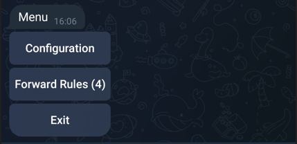
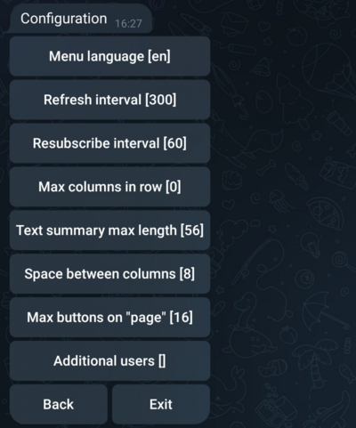
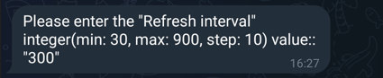
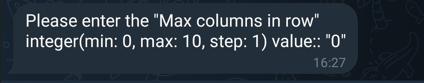
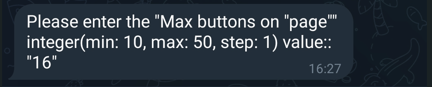
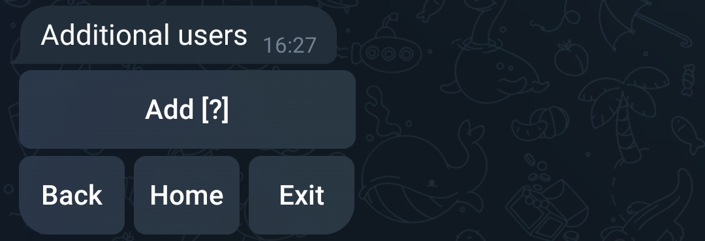

# Telegram Forward User Bot

[](https://hub.docker.com/r/petrovoronov/telegram-forward-user-bot)
[](https://hub.docker.com/r/petrovoronov/telegram-forward-user-bot)
[](LICENSE)
[](https://github.com/PetroVoronov/telegram-forward-user-bot/commits/main)
[](https://github.com/PetroVoronov/telegram-forward-user-bot/issues)
[](https://github.com/PetroVoronov/telegram-forward-user-bot/pulls)

## About
A Telegram "bot" working as a user, using MTProto via [gramjs](https://github.com/gram-js/gramjs), to forward messages between chats/groups/channels. Configurable via Bot menu.

## Description
This package provides a functionality to forward messages between chats/groups/channels using a Telegram API to work as a user.
It has a built-in bot to configure the behavior of the user instance.
The bot can be used to configure:
 - the common parameters, such as setting the refresh interval, the number of columns in a row, the text summary max length, the space between columns, the max buttons on a "page", and additional users.
 - The forwarding rules itself, such as the source chat and the destination chat, including the separate topics for "forums" and "super groups", and keywords or phrases to filter messages.

## Table of Contents

- [Telegram Forward User Bot](#telegram-forward-user-bot)
  - [About](#about)
  - [Description](#description)
  - [Table of Contents](#table-of-contents)
  - [Prerequisites](#prerequisites)
  - [Installation](#installation)
  - [Usage](#usage)
    - [Running Locally](#running-locally)
    - [Running in Docker](#running-in-docker)
  - [Command Line Options](#command-line-options)
  - [Configuration via Telegram Bot Menu](#configuration-via-telegram-bot-menu)
    - [Accessing the Bot Menu](#accessing-the-bot-menu)
    - [Configuration Options](#configuration-options)
      - [Menu Language](#menu-language)
      - [Refresh Interval](#refresh-interval)
      - [Max Columns in Row](#max-columns-in-row)
      - [Text Summary Max Length](#text-summary-max-length)
      - [Space Between Columns](#space-between-columns)
      - [Max Buttons on "Page"](#max-buttons-on-page)
      - [Additional Users](#additional-users)
  - [Scripts](#scripts)
  - [License](#license)
  - [Author](#author)


## Prerequisites

- Node.js (version 22 or later)
- npm (version 7 or later)
- Docker (optional, for running in a container)

## Installation

1. Clone the repository:

    ```sh
    git clone https://github.com/yourusername/telegram-forward-user-bot.git
    cd telegram-forward-user-bot
    ```

2. Install the dependencies:

    ```sh
    npm install
    ```

## Usage

### Running Locally

1. Start the bot:

    ```sh
    npm start
    ```

2. For debugging:

    ```sh
    npm run debug
    ```

3. For help:

    ```sh
    npm run help
    ```

### Running in Docker

1. Build the Docker image:

    ```sh
    docker build -t telegram-forward-user-bot .
    ```

2. Run the Docker container:

    ```sh
    docker run -it --rm --name telegram-forward-user-bot telegram-forward-user-bot
    ```

## Command Line Options

The Telegram Forward User Bot supports several command line options to customize its behavior. Below are the available options:

- `-r, --refresh-interval <number>`: Refresh information from Telegram servers, in seconds. Default is 300 seconds.
- `-b, --no-bot`: Start without the bot instance.
- `-d, --debug`: Enable debug level logging.
- `--debug-client-user`: Enable debug level logging for the client "user" instance.
- `--debug-client-bot`: Enable debug level logging for the client "bot" instance.
- `-c, --command <string>`: Test menu command from the command line.
- `-h, --help`: Display help information.
- `--version`: Display the version of the script.


## Configuration via Telegram Bot Menu

The Telegram Forward User Bot can be configured directly through its interactive bot menu. Below are the steps and options available for configuration:

### Accessing the Bot Menu

1. Start the application.

2. Open Telegram and start a chat with your bot. The chat between a bot and user used by application to work with sources will be created after first start

3. Use the ```/start``` command to show the menu.



### Configuration Options

The bot menu provides several configuration options to customize the behavior of the bot.



Below are the available options:

#### Menu Language


Used to set the language of the menu. Currently, only four languages are supported: English, German, Ukrainian, and Russian.

#### Refresh Interval

Used to set the interval to refresh data from Telegram servers, in seconds. In some cases the "standard" subscription on changes in sources chats is not working properly, so this interval is used to refresh the not only a list of available chats, but also the messages in the sources chats.



#### Max Columns in Row

Used to set the maximum count of columns in one row of the menu. Zero means that the bot will try to calculate the optimal count of columns in each rows individually based on the value of next parameter - [Text Summary Max Length](#text-summary-max-length).



#### Text Summary Max Length

Used to set the approximated max length of the text in one row of the menu. The bot will try to calculate the optimal count of columns based on this value and the value of the previous parameter - [Max Columns in Row](#max-columns-in-row).


#### Space Between Columns

Used to set the space between columns in the menu. The value is in characters.


#### Max Buttons on "Page"



Used to set the maximum count of buttons on one "page" or "screen" of the menu. If not all buttons fit on one "page", the bot will split them into multiple "pages", and the user will be able to navigate between them.

#### Additional Users

Used to add additional users to the bot. The primary user is the one who can access the bot menu and configure the bot. Additional users can be added to have an access to the bot menu and configure the bot as well.



To add a new user, use the "Add" button.


Then simple select appropriate one from the list of available users. The list of available users is limited to the users known by the primary user.

## Scripts

- `version`: Generates the version file.
- `lint`: Lints the codebase using ESLint.
- `start`: Starts the bot.
- `debug`: Starts the bot in debug mode.
- `help`: Displays help information.

## License

This project is licensed under the MIT License. See the [LICENSE](LICENSE) file for details.

## Author

Petro Voronov <petro.voronov@gmail.com>